<p align="center">
  <h1 align="center">Agent Identity Protocol (AIP)</h1>
  <p align="center"><em>The Zero-Trust Identity Layer for MCP & Autonomous Agents</em></p>
</p>

<p align="center">
  <a href="https://goreportcard.com/report/github.com/ArangoGutierrez/agent-identity-protocol"></a>
  <a href="LICENSE"></a>
  <a href="https://github.com/ArangoGutierrez/agent-identity-protocol/actions/workflows/ci.yml"></a>
  <a href="https://securityscorecards.dev/viewer/?uri=github.com/ArangoGutierrez/agent-identity-protocol"></a>
  <a href="https://twitter.com/ArangoGutworker"></a>
</p>

---

## The God Mode Problem

Today's AI agents operate with **unrestricted access** to your infrastructure. When you connect Claude, Cursor, or any MCP-compatible agent to your systems, it receives *god mode*—full access to every tool the server exposes.

Model safety isn't enough. **Indirect Prompt Injection** attacks—like [GeminiJack](https://embrace-the-red.com/blog/gemini-jack/)—have proven that adversarial instructions embedded in documents, emails, or data can hijack agent behavior. The model *believes* it's following your intent while executing the attacker's commands.

Your agent is one poisoned PDF away from `rm -rf /`.

> ***"Authentication is for Users. AIP is for Agents."***

AIP introduces **policy-based authorization** at the tool-call layer—the missing security primitive between your agents and your infrastructure.

---

## Architecture

### High-Level Flow

AIP operates as a transparent proxy between the AI client (Cursor, Claude, VS Code) and the MCP tool server. Every tool call passes through the policy engine before reaching the real tool.

```mermaid
graph LR
    subgraph Client
        A[🤖 Cursor / Claude]
    end
    
    subgraph AIP["🛡️ AIP Proxy"]
        B[Policy Engine]
        C[DLP Scanner]
        D[Audit Log]
    end
    
    subgraph Server
        E[🔧 Docker / Postgres / GitHub]
    end
    
    A -->|tools/call| B
    B -->|ALLOW| E
    B -->|DENY| A
    B --> C
    C --> D
    E -->|response| C
    C -->|filtered| A
    
    style B fill:#22c55e,stroke:#16a34a,stroke-width:2px,color:#fff
    style AIP fill:#f0fdf4,stroke:#16a34a,stroke-width:3px
```



### Defense-in-Depth: Attack Blocked

When an injected prompt attempts to execute a dangerous operation, AIP intercepts and blocks it before the tool ever receives the request.

```mermaid
sequenceDiagram
    participant Agent as 🤖 Agent (Hijacked)
    participant AIP as 🛡️ AIP Proxy
    participant Policy as 📋 agent.yaml
    participant Tool as 🔧 Real Tool

    Agent->>AIP: tools/call "delete_database"
    AIP->>Policy: Check allowed_tools
    Policy-->>AIP: ❌ Not in allowlist
    AIP->>AIP: Decision: BLOCK
    AIP-->>Agent: Error: -32001 Forbidden
    Note over Tool: Never receives request
    Note over AIP: Logged to audit trail
```



---

## Why AIP?

| Feature | Standard MCP | AIP-Enabled MCP |
|---------|--------------|-----------------|
| **Prompt Injection** | ⚠️ Vulnerable — Executes any command | ✅ Protected — Blocks unauthorized intent |
| **Data Exfiltration** | ⚠️ Unrestricted internet access | ✅ Egress filtering + DLP redaction |
| **Consent Fatigue** | ⚠️ Click "Allow" 50 times per session | ✅ Policy-based autonomy |
| **Audit Trail** | ⚠️ None / stdio logs | ✅ Immutable JSONL structured logs |
| **Privilege Model** | ⚠️ All-or-nothing API keys | ✅ Per-tool, per-argument validation |
| **Human-in-the-Loop** | ⚠️ Not supported | ✅ Native OS approval dialogs |

---

## Quick Start

Secure any MCP tool server in one command:

```bash
# Wrap your Docker MCP server with a read-only policy
aip wrap docker --policy ./policies/read-only.yaml
```

Or protect your existing configuration:

```bash
# Start the AIP proxy with your policy
aip --target "python mcp_server.py" --policy ./agent.yaml

# Generate Cursor IDE configuration
aip --generate-cursor-config --policy ./agent.yaml --target "npx @mcp/server"
```

### Example Policy

```yaml
apiVersion: aip.io/v1alpha1
kind: AgentPolicy
metadata:
  name: secure-agent
spec:
  mode: enforce
  allowed_tools:
    - read_file
    - list_directory
    - git_status
  tool_rules:
    - tool: write_file
      action: ask        # Human approval required
    - tool: exec_command
      action: block      # Never allowed
  dlp:
    patterns:
      - name: "AWS Key"
        regex: "AKIA[A-Z0-9]{16}"
```

---

## Documentation

| Resource | Description |
|----------|-------------|
| [AIP Specification](spec/aip-v1alpha1.md) | Formal protocol definition (v1alpha1) |
| [Policy Reference](docs/policy-reference.md) | Complete YAML schema |
| [Go Proxy README](implementations/go-proxy/README.md) | Reference implementation |
| [Quickstart Guide](implementations/go-proxy/docs/quickstart.md) | 5-minute tutorial |
| [Why AIP?](docs/why-aip.md) | Threat model and design rationale |
| [FAQ](docs/faq.md) | Common questions |

---

## Roadmap

We're building a **standard**, not just a tool.

- [x] **v0.1: Localhost Proxy** — The *"Little Snitch"* for AI Agents
  - Tool allowlist enforcement
  - Argument validation with regex
  - Human-in-the-Loop (macOS, Linux)
  - DLP output scanning
  - JSONL audit logging
  - Monitor mode

- [ ] **v0.2: Kubernetes Sidecar** — The *"Istio"* for AI Agents
  - Helm chart
  - NetworkPolicy integration
  - Prometheus metrics

- [ ] **v1.0: Federation** — Enterprise Identity
  - OIDC / SPIFFE identity federation
  - Centralized policy management
  - Multi-tenant audit aggregation

---

## Repository Structure

```
agent-identity-protocol/
├── spec/                        # THE PROTOCOL
│   ├── aip-v1alpha1.md          # Specification document
│   ├── schema/                  # JSON Schema for validation
│   └── conformance/             # Test suite for implementations
├── implementations/             # IMPLEMENTATIONS
│   └── go-proxy/                # Reference implementation (Go)
│       ├── cmd/aip-proxy/       # Main binary
│       ├── pkg/                 # Libraries (policy, dlp, audit, ui)
│       └── examples/            # Example policies
└── docs/                        # DOCUMENTATION
    ├── why-aip.md               # Problem statement
    ├── policy-reference.md      # Policy YAML reference
    └── faq.md                   # Common questions
```

---

## Contributing

AIP is an open specification. We welcome:

- **Protocol feedback** — Issues and PRs to the spec
- **New implementations** — Build AIP in Rust, TypeScript, Python
- **Security research** — Threat modeling, attack surface analysis
- **Documentation** — Tutorials, examples, integrations

See [CONTRIBUTING.md](CONTRIBUTING.md) for guidelines.

---

## License

**Apache 2.0** — See [LICENSE](LICENSE)

Enterprise-friendly. Use it, fork it, build on it.

---

## Security

For vulnerability reports, see [SECURITY.md](SECURITY.md).

---

<p align="center">
  <strong>Stop trusting your agents. Start verifying them.</strong>
</p>
